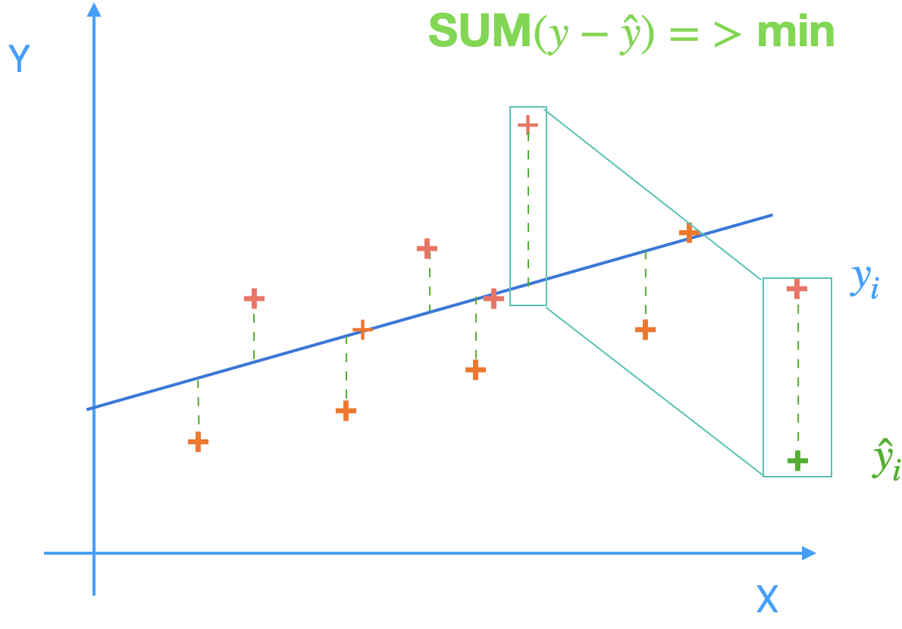
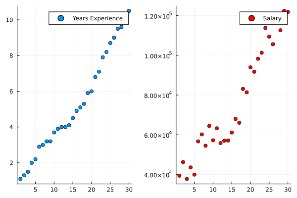
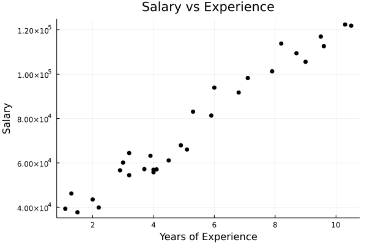
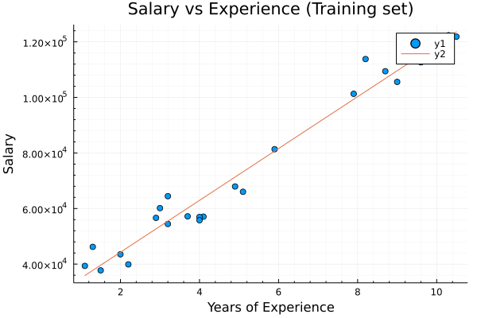
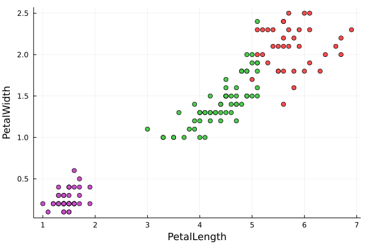
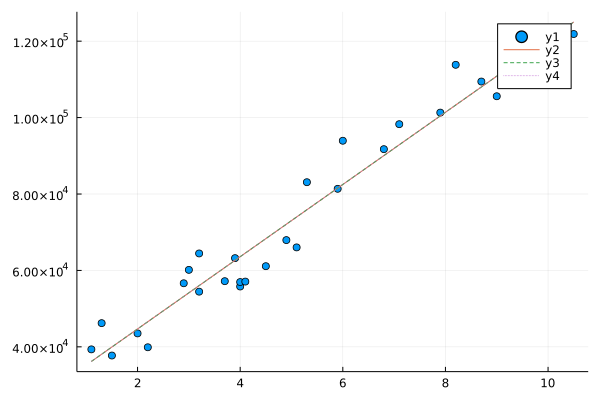
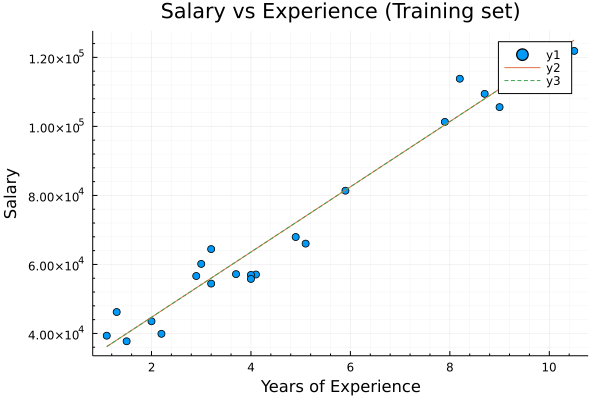
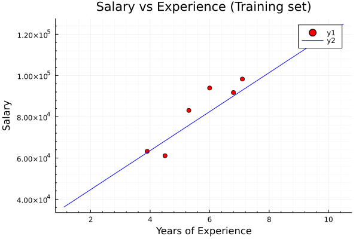

# Supervised Learning

Supervised learning is a type of machine learning in which the algorithm learns to map input data to a set of known output data. In supervised learning, we are given a dataset (x, y) in which x represents the input data and y represents the corresponding output labels. The goal of supervised learning is to train a model that can predict the output labels for new input data based on the patterns learned from the training data.


## <span style="color:#469586;font-weight:500;font-size:30px"> Types of Supervised Learning </span>
There are two main types of supervised learning: 

* <span font-weight:500;font-size:15px"> Regression </span>
* <span font-weight:500;font-size:15px"> Classification: </span>

## <span style="color:#469586;font-weight:500;font-size:30px"> Supervised Learning Process </span>
The process of supervised learning involves the following steps:

* <span font-weight:500;font-size:15px"> Data Collection:</span>
The first step in supervised learning is to collect a labeled dataset. This dataset should be representative of the problem that the model is intended to solve.

* <span font-weight:500;font-size:15px"> Data Preprocessing:</span>
The next step is to preprocess the data. This includes cleaning the data, removing any outliers or missing values, and transforming the data into a format that can be used by the algorithm.

* <span font-weight:500;font-size:15px"> Feature Extraction:</span>
The third step is to extract features from the data. This involves selecting the relevant features that are important for the model to learn.

* <span font-weight:500;font-size:15px"> Model Selection:</span>
The next step is to select a suitable algorithm or model for the problem. This depends on the type of problem and the characteristics of the dataset.

* <span font-weight:500;font-size:15px"> Testing:</span>
Finally, the performance of the model is evaluated on a test set to measure its accuracy and generalization to new data.

#### <span style="color:#469586;font-weight:500;font-size:30px"> Regression </span>

Regression is a type of supervised learning in which the algorithm learns to predict a continuous output variable based on input data. In regression, the goal is to fit a mathematical function to the data that can be used to make predictions on new, unseen data. In this lecture note, we will explore the basics of regression in supervised learning.

##### <span style="color:#469586;font-weight:500;font-size:20px"> Types of Regression </span>
There are different types of regression algorithms that can be used in supervised learning, including linear regression, polynomial regression, and logistic regression.

In regression, the goal is to fit a mathematical function to the data that can be used to make predictions on new, unseen data. In this lecture note, we will explore the basics of regression in supervised learning.

##### <span style="color:#469586;font-weight:500;font-size:20px"> Simple Linear regression </span>

The key idea is to consider a dependent variable Y and see how it is affected by one or more independent variables, typically denoted by x.

```math
y = β_0 + β_1 x
```

where:

- y  = Depedent variable
- x  = Independent variable
- β0 = Intrecept
- β1 = slope.


{ width="600" height="600" style="display: block; margin: 0 auto" }

###### <span style="font-weight:500;font-size:20px"> Importing the libraries </span>

```jl linenums="1"
begin
    using DataFrames
    using Statistics, StatsBase
    using CSV
    using ScikitLearn
    using Plots, StatsPlots
    using BenchmarkTools
    using PyCall
end

```

###### <span style="font-weight:500;font-size:20px">Importing the dataset </span>

```julia
julia> dataset = CSV.read("Salary_Data.csv", DataFrame);
```

```julia
julia> @show names(dataset)
```

```jl linenums="1"
julia> X = dataset[:, :1];
julia> y = dataset[:, :2];
```

```jl linenums="1"
 yExperience = df[!, :YearsExperience]
 s1=scatter(yExperience, label="Years Experience")
 salary = df[!, :Salary]
 s2 = scatter(salary,label="Salary", color = :red);
 plot(s1,s2)
```

{ width="600" height="600" style="display: block; margin: 0 auto" }


```julia linenums="1"
julia> scatter(yExperience, salary, color=:black, leg=false, xaxis="Years of Experience", yaxis="Salary")
julia> title!("Salary vs Experience")
```

{ width="600" height="600" style="display: block; margin: 0 auto" }

###### <span style="font-weight:500;font-size:20px"> Splitting the dataset </span>

```julia
julia> using ScikitLearn.CrossValidation: train_test_split
```

```julia
X_train, X_test, y_train, y_test = train_test_split(X, y, test_size=0.2, random_state=1)
```
**Linear Regression with single variable (i.e salary)**
Training the Simple Linear Regression model on the Training set using *GLM.jl*

```julia
julia> using GLM, DataFrames
```

```julia
julia> dataTrain = DataFrame(X_train=X_train, y_train=y_train);
```

```julia
julia> linearRegressor = lm(@formula(y_train ~ X_train), dataTrain)
```

```julia
julia> y_pred = GLM.predict(linearRegressor);
y_pred;
```
###### <span style="font-weight:500;font-size:20px"> Visualising the Training set results </span>

```jl linenums="1"
julia> scatter(X_train, y_train)
plot!(X_train, y_pred)
title!("Salary vs Experience (Training set)")
xaxis!("Years of Experience", minorgrid = true)
yaxis!("Salary", minorgrid = true)
```

{ width="600" height="600" style="display: block; margin: 0 auto" }


```julia linenums="1"
scatter(X_test, y_test, color=:red)
plot!(X_train,  y_pred, color=:blue)
title!("Salary vs Experience (Training set)")
xaxis!("Years of Experience", minorgrid = true)
yaxis!("Salary", minorgrid = true)
```

{ width="600" height="600" style="display: block; margin: 0 auto" }

###### <span style="font-weight:500;font-size:20px"> Predicting the Test set results </span>

```julia linenums="1"
function find_best_fit(xvals,yvals)
    meanx = mean(xvals)
    meany = mean(yvals)
    stdx = std(xvals)
    stdy = std(yvals)
    r = cor(xvals,yvals)
    a = r*stdy/stdx
    b = meany - a*meanx
    return a,b
end
```


```julia linenums="1"
a,b = find_best_fit(X,y)
ynew = a .* X .+ b;
```

```julia
np = pyimport("numpy");
```
```julia linenums="1"
@time myfit = np.polyfit(X, y, 1);
ynew2 = collect(X) .* myfit[1] .+ myfit[2];
```

```julia linenums="1"
scatter(yExperience, salary)
plot!(yExperience,ynew2)
plot!(yExperience,ynew, linestyle = :dash)
```

{ width="600" height="600" style="display: block; margin: 0 auto" }

```julia linenums="1"
data = DataFrame(X=xdata, Y=ydata)
ols = lm(@formula(Y ~ X), data)
plot!(xdata,predict(ols), linestyle = :dot)
```

{ width="600" height="600" style="display: block; margin: 0 auto" }


```julia linenums="1"
scatter(X_train, y_train)
plot!(X, ynew2)
plot!(X, ynew, linestyle = :dash)
title!("Salary vs Experience (Training set)")
xaxis!("Years of Experience", minorgrid = true)
yaxis!("Salary", minorgrid = true)
```

{ width="600" height="600" style="display: block; margin: 0 auto" }

```julia linenums="1"
scatter(X_test, y_test, color=:red)
plot!(X, ynew, color=:blue)
title!("Salary vs Experience (Training set)")
xaxis!("Years of Experience", minorgrid = true)
yaxis!("Salary", minorgrid = true)
```
{ width="600" height="600" style="display: block; margin: 0 auto" }


##### <span style="color:#469586;font-weight:500;font-size:20px"> Multiple Linear Regression </span>
Multiple linear regression (MLR), also known simply as multiple regression, is a statistical technique that can be used to analyze the relationship between a single dependent variable and several independent variables.

```julia 
 y = β0 + β1 x1 + β2 x2 + ...+ βn xn
```
where:

- y  = Depedent variable
- x  = Independent variable
- β0 = Intrecept
- βn = slope.

###### <span style="font-weight:500;font-size:20px"> Importing the dataset </span>

```linenums="1"
julia> dataset = CSV.read("50_Startups.csv", DataFrame);
julia> rename!(dataset, Symbol.(replace.(string.(names(dataset)), Ref(r"\[m\]"=>""))))
julia> rename!(dataset, Symbol.(replace.(string.(names(dataset)), Ref(r"\[s\]"=>""))))
julia> rename!(dataset, Symbol.(replace.(string.(names(dataset)), Ref(r"\s"=>""))))
```

```julia linenums="1"
julia> X = dataset[:, 1:4];
julia> y = dataset[:, :5];
```

```julia
print(y)
```

###### <span style="font-weight:500;font-size:20px"> Encoding categorical data </span>
```julia linenums="1"
julia> import Pkg;
julia> Pkg.add("ScikitLearn")
julia> Pkg.update()
```

```julia linenums="1"
using ScikitLearn
@sk_import preprocessing: (LabelBinarizer, StandardScaler)
```

```julia linenums="1"
mapper = DataFrameMapper([
     (:State, LabelBinarizer()),
     (:RDSpend, nothing),
     (:Administration, nothing),
     (:MarketingSpend, nothing)])
```


```julia
X = fit_transform!(mapper, copy(dataset))
```

###### <span style="font-weight:500;font-size:20px"> Splitting dataset </span>

Splitting the dataset into the Training set and Test set


```julia
using ScikitLearn.CrossValidation: train_test_split
```

```julia
X_train, X_test, y_train, y_test = train_test_split(X, y, test_size=0.2, random_state=1)
```

```julia
@sk_import linear_model: LinearRegression
```

```julia linenums="1"
regressor = LinearRegression()
regressor.fit(X_train, y_train)
```

###### <span style="font-weight:500;font-size:20px"> Predicting the Test set results </span>


```julia
y_pred = regressor.predict(X_test)

comp = [y_test, y_pred]
```


###### <span style="font-weight:500;font-size:20px"> Training MLR model </span>


```julia
using Lathe.preprocess: TrainTestSplit
```


```julia
using GLM
```


```julia
train, test = TrainTestSplit(dataset,.75);
```


##### <span style="color:#469586;font-weight:500;font-size:20px">  Polynomial Regression </span>

##### <span style="color:#469586;font-weight:500;font-size:20px">  Support Vector Regression </span>

##### <span style="color:#469586;font-weight:500;font-size:20px">  Decision Tree regression </span>

##### <span style="color:#469586;font-weight:500;font-size:20px">  Random Forest Regression </span>

#### <span style="color:#469586;font-weight:500;font-size:30px"> Classification </span>

- Clustering is a very commonly used method in unsupervised learning.
- It works on 2D data where the goal is to create clusters based on coordinates.


###### <span style="color:#469586;font-weight:500;font-size:20px"> Logistic Regression </span>
Logistic regression is a simple and commonly used algorithm for binary classification. It models the probability of an observation belonging to one of two categories.

- Logistic Regression is basically a predictive algorithm in Machine Learning used for binary classification
-  It predicts the probability of a class and then classifies it based on the predictor variables’ values.
- Analogous to linear regression in some aspects, logistic regression y needs to lie between 0 and 1.

Linear equation: 

```math 
y = b_{0} + b_{1}\times x
```

The logistic function is of the form:

```math
P = \frac{1}{1+ e^{-y}}
```

Computing the value of y from the above equation and then putting in the linear regression equation, we get:

```math
ln(\frac{P}{1-P}) = b_{0} + b_{1}\times x
```

**Dataset:**

This data set contains details of a bank's customers and the target variable is a binary variable reflecting the fact whether the customer left the bank (closed his account) or he continues to be a customer.

```julia linenums="1"
julia> df = DataFrame(CSV.File("churn modelling.csvb"))
julia> rename!(df, Symbol.(replace.(string.(names(df)), Ref(r"\[m\]"=>""))));
julia> rename!(df, Symbol.(replace.(string.(names(df)), Ref(r"\[s\]"=>""))));
julia> rename!(df, Symbol.(replace.(string.(names(df)), Ref(r"\s"=>""))));
```

###### <span style="font-weight:500;font-size:20px"> Importing the libraries </span>

```julia linenums="1"
using Lathe
using DataFrames
using Plots;
using GLM
using StatsBase
using MLBase
using ROCAnalysis
using CSV
```

###### <span style="font-weight:500;font-size:20px"> Load the dataset </span>


###### <span style="color:#469586;font-weight:500;font-size:20px"> K-Nearest Neighbors (K-NN) </span>

###### <span style="color:#469586;font-weight:500;font-size:20px"> Support Vector Machine (SVM) </span>

###### <span style="color:#469586;font-weight:500;font-size:20px"> Kernel SVM </span>

###### <span style="color:#469586;font-weight:500;font-size:20px"> Naive Bayes </span>

###### <span style="color:#469586;font-weight:500;font-size:20px"> Decision Tree Classification </span>
Decision trees are a versatile and powerful algorithm for classification. They create a tree-like model of decisions and their possible consequences, based on the input variables.


###### <span style="color:#469586;font-weight:500;font-size:20px"> Random Forest Classification </span>
Random forest is an ensemble learning algorithm that uses multiple decision trees to improve the accuracy of the model. It combines the predictions of multiple decision trees to make more accurate predictions.


### <span style="color:#469586;font-weight:500;font-size:20px"> Take home message </span>
These foundational concepts provide a basis for developing and understanding machine learning algorithms and models. To become proficient in machine learning, it is important to have a strong understanding of these foundational concepts and how they are applied in different machine learning tasks.