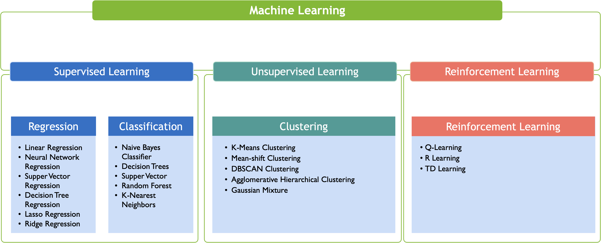

# Introduction  

Welcome to the complete course on Machine Learning!

!!! abstract "Overview"
    In this course, we will cover everything you need to know about machine learning, from the basics to advanced topics, including supervised learning, unsupervised learning, deep learning, reinforcement learning, and more.

##  What is Machine Learning?
Machine learning is a subfield of artificial intelligence that focuses on the development of algorithms and models that enable computers to learn and make predictions or decisions based on input data.

Essentially, machine learning algorithms are designed to recognize patterns and make predictions or decisions based on those patterns, without being explicitly programmed to do so. The algorithms are trained on a large dataset, and as they receive more data, they improve their accuracy and decision-making capabilities.

This is achieved through the use of statistical and mathematical techniques that enable the system to identify patterns and relationships within the data, and then use this knowledge to make predictions or decisions about new data.

There are several types of machine learning, including supervised learning, unsupervised learning, and reinforcement learning, each of which has its own unique approach to learning from data.

###  Applications of Machine Learning 
Machine learning has a wide range of applications in various fields. Machine learning algorithms are used to

*  Image and speech recognition:  Include virtual assistants like Siri and Alexa, facial recognition for security systems, and image recognition for self-driving cars.

*  Natural language processing:  Include chatbots, language translation, and voice recognition.

*  Predictive analytics:  Analyze large amounts of data to predict future outcomes or identify trends, making it useful in fields like finance, healthcare, and marketing.

*  Autonomous vehicles:  Self-drive cars rely heavily on machine learning algorithms to interpret and respond to real-time driving conditions.

*  Fraud detection:  Machine learning is used in fraud detection systems to identify and flag suspicious activity in real-time.

*  Medical diagnosis:  Machine learning is used to analyze medical data, such as images and test results, to assist in diagnosis and treatment planning.

*  Financial modeling:   Machine learning is used in financial modeling to predict market trends, analyze risk, and optimize investment strategies.

These are just a few examples of the many applications of machine learning. As the technology continues to evolve, its potential applications will only continue to grow.

###  Foundations of Machine Learning 
Machine learning is a field of computer science that involves the development of algorithms and models that allow computers to learn and improve their performance based on experience or data. The foundations of machine learning are rooted in mathematics, statistics, and computer science. Some of the key foundational concepts of machine learning include:

*  Linear algebra:  
Linear algebra is used to represent and manipulate data in the form of vectors and matrices. It is used extensively in machine learning algorithms such as regression, classification, and clustering.

*  Statistics:  
Statistics is used to analyze and interpret data in machine learning algorithms. It is used to measure the accuracy of predictions, to identify patterns in data, and to evaluate the performance of machine learning models.

*  Probability theory:  
Probability theory is used to model uncertainty in machine learning algorithms. It is used to estimate the likelihood of different outcomes and to make predictions based on statistical inference.

*  Optimization theory:  
Optimization is used to optimize machine learning algorithms by minimizing a loss function that measures the error between the predicted output and the actual output. Gradient descent is a popular optimization algorithm used in machine learning.

###  Classes of Learning Problmes 

                                                        
##  Course Outline 
 Here is a comprehensive outline of the content that a complete course on Machine Learning may include:
###  Introduction to Machine learning

*  What is machine learning? 
*  Applications of Machine Learning 

###  Foundations of Machine Learning 

####  Linear Algebra for Machine Learning 

* Scalars, Vectors, Matrices, and Tensors
* Matrix Multiplication
* Matrix Inverse and Transpose
* Eigenvalues and Eigenvectors

####  Probability and Statistics for Machine Learning 

* Probability Theory
* Random Variables and Probability Distributions
* Bayes' Theorem
* Maximum Likelihood Estimation

####  Optimization for Machine Learning 
* Gradient Descent
* Stochastic Gradient Descent
* Newton's Method
* Constrained Optimization

###   Types of machine learning 

###   [Supervised Learning](Supervised Learning.md) 

*  Regression Analysis 
    * Simple Linear Regression
    * Multiple Linear Regression
    * Polynomial Regression

*  Classification 
    * Logistic Regression
    * Decision Trees
    * Random Forest
    * Support Vector Machines (SVM)
    * K-Nearest Neighbors (KNN)
    * Naive Bayes
    * Neural Networks

###  [Unsupervised Learning](Unsupervised Learning.md) 
*  Clustering 
    * k-Means Clustering
    * Hierarchical Clustering
    * Density-Based Clustering

*  Dimensionality Reduction 
    * Principal Component Analysis (PCA)
    * Singular Value Decomposition (SVD)

###  Reinforcement Learning 
*  Introduction to Reinforcement Learning 
    * Markov Decision Process (MDP)
    * Q-Learning
    * Deep Reinforcement Learning

###  Take home message 

These foundational concepts provide a basis for developing and understanding machine learning algorithms and models. To become proficient in machine learning, it is important to have a strong understanding of these foundational concepts and how they are applied in different machine learning tasks.

